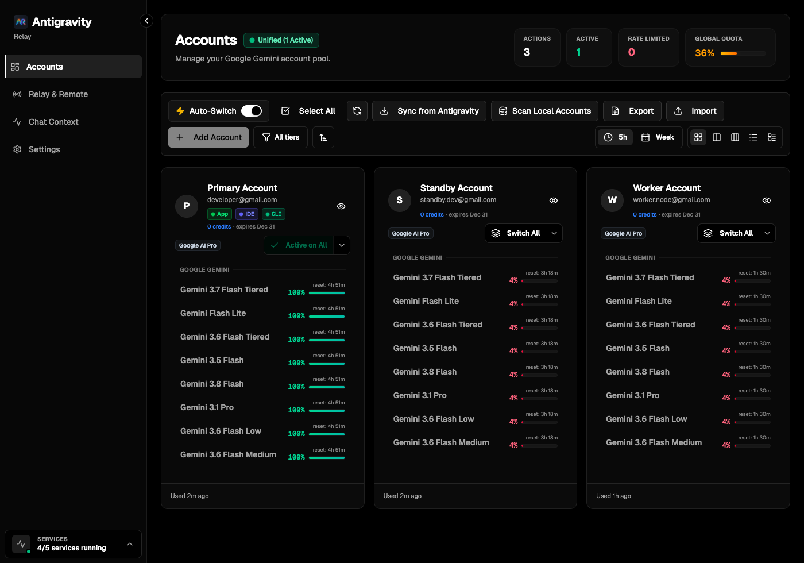
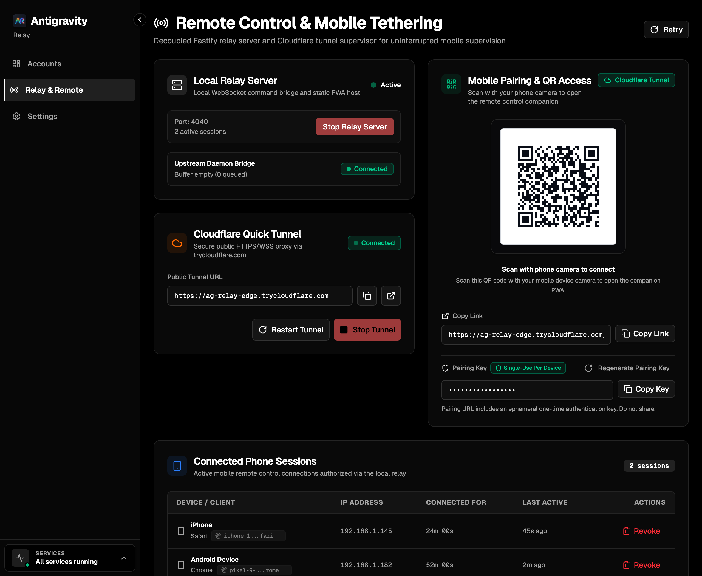
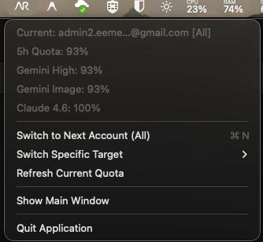

# Antigravity Relay

Desktop account management, quota orchestration, and mobile remote relay for Google Antigravity (**Antigravity App**, **Antigravity IDE**, and **Antigravity CLI**).



> **Attribution**: Forked and adapted from [Antigravity Manager](https://github.com/Draculabo/AntigravityManager) by Draculabo. Antigravity Relay focuses on the Google Antigravity ecosystem, strips third-party telemetry, and isolates local storage to `~/.antigravity-relay/`.

---

## Highlights

### 1. Multi-Target Credential Pooling & Quota Orchestration

Connect multiple Google accounts via OAuth 2.0 loopback authentication. Synchronize credentials across all Google Antigravity environments:

- **Antigravity App**: Standalone desktop command center.
- **Antigravity IDE**: AI-first code editor.
- **Antigravity CLI**: Terminal interface (`agy <command>`).

Track quota fractions, rolling pool limits, and individual model quotas with automatic failover on depletion.

### 2. Remote Mobile Tethering & Web UI Mirror

Supervise and control Antigravity sessions from mobile or desktop browsers over local Wi-Fi or Cloudflare Tunnels.



- **Fastify Reverse Proxy**: Local relay server running alongside Antigravity.
- **Cloudflare Tunnel**: Optional one-click HTTPS/WSS pairing via `cloudflared`.
- **QR Pairing**: Single-use tokenized QR codes for instant mobile connection.
- **Device Management**: Persistent device tracking with remote session revocation.

### 3. System Tray Quick Switcher

Resident in your macOS Menu Bar / Windows System Tray for fast rotation.



- **Global & Target Rotation**: Switch all targets at once or rotate specific targets independently.
- **At-a-Glance Quota**: View target status and pool limits directly from the tray.
- **Background Mode**: Minimizes to tray with zero UI overhead.

### 4. Active Chat Auto-Resume After Switch

Preserves in-flight generations across account rotations.

- **Turn Capture & Checkpoint**: Captures running turns and checkpoints database journals before process restart.
- **Ready Gate Dispatch**: Awaits language server readiness before re-dispatching prompt.
- **Strict Model Fidelity**: Never downgrades models. If quota is unavailable, preserves prompt in draft scratch.
- **Desktop Scoped**: Operates on App and IDE; CLI runs headlessly without restarts.
- **Configurable**: Toggle on/off under Settings.

---

## Features

- **Multi-Target Sync**: Manage credentials across App, IDE, and CLI independently or unified.
- **Chat Auto-Resume**: Recovers in-flight prompts across account switches without manual re-typing.
- **Account Pooling**: Multiple Google accounts with automated failover on quota exhaustion.
- **Local Account Import**: Discovers existing sign-ins from system credential stores, CLI sessions, and IDE storage.
- **Quota Tracking**: Real-time quota monitoring, countdown timers, and rate-limit alerts.
- **Mobile Remote Relay**: Web UI mirror accessible over local network or Cloudflare Tunnels.
- **Device Session Control**: Tokenized pairing, heartbeat tracking, and one-click session revocation.
- **Tray Quick Switcher**: Background residency with global shortcuts and quick switching.
- **Auto-Update**: Built-in updates via `electron-updater` with architecture-aware fallbacks.
- **Privacy & Security**: Zero third-party telemetry; data encrypted at rest (AES-256-GCM) via OS Keyring.

---

## Supported Platforms

- **macOS**: Apple Silicon (`arm64`) and Intel (`x64`) - DMG and ZIP
- **Windows**: x64 and ARM64 - Installer (`.exe`) and Squirrel package (`.nupkg`)
- **Linux**: x64 (`amd64`) and ARM64 (`aarch64`) - Debian (`.deb`) and Red Hat (`.rpm`)

> **macOS Installation Note ("App is damaged")**:  
> For unsigned open-source builds, clear the quarantine attribute:
>
> ```bash
> xattr -cr "/Applications/Antigravity Relay.app"
> ```

---

## Tech Stack

- **Runtime**: Electron 37+, Node.js 22+
- **Frontend**: React 19, Vite 6, Tailwind CSS 4, Radix UI, TanStack Router & Query
- **Backend / IPC**: Fastify, oRPC, SQLite (better-sqlite3) via Drizzle ORM
- **Packaging**: Electron Forge

---

## Quick Start

### Prerequisites

- Node.js >= 22.14.0
- pnpm >= 10
- `cloudflared` _(optional, for Cloudflare Tunnel)_:
  - macOS: `brew install cloudflared`
  - Windows: `winget install --id Cloudflare.cloudflared`
  - Linux: `sudo apt install cloudflared`

### Installation

```bash
git clone https://github.com/hudiohizari/antigravity-relay.git
cd antigravity-relay
pnpm install
```

### Development

```bash
pnpm start
```

### Type Checking & Testing

```bash
pnpm run type-check
pnpm test
```

### Packaging

```bash
pnpm run package
pnpm run make
```

---

## Storage & Security

- **Database**: `~/.antigravity-relay/cloud_accounts.db` (AES-256-GCM authenticated encryption)
- **Config & Logs**: `~/.antigravity-relay/`
- **Keytar Service**: `AntigravityRelay`

---

## License

MIT
