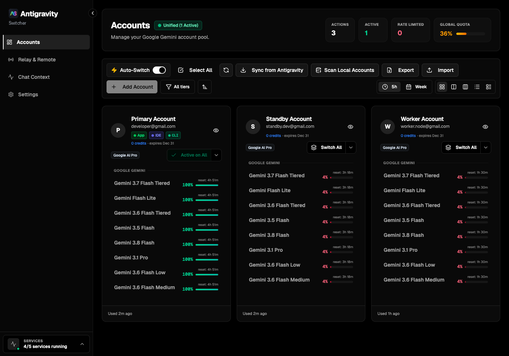
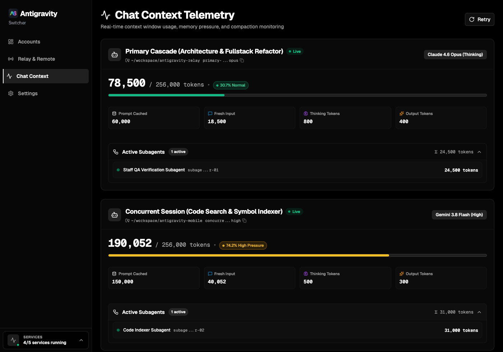
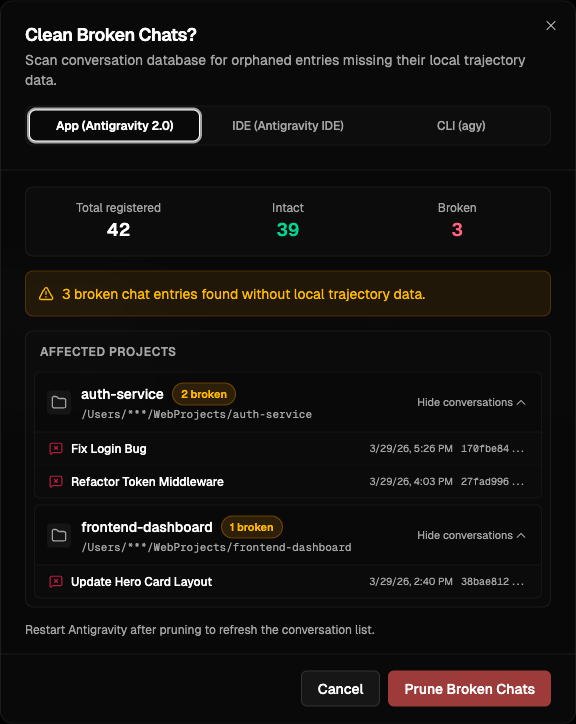
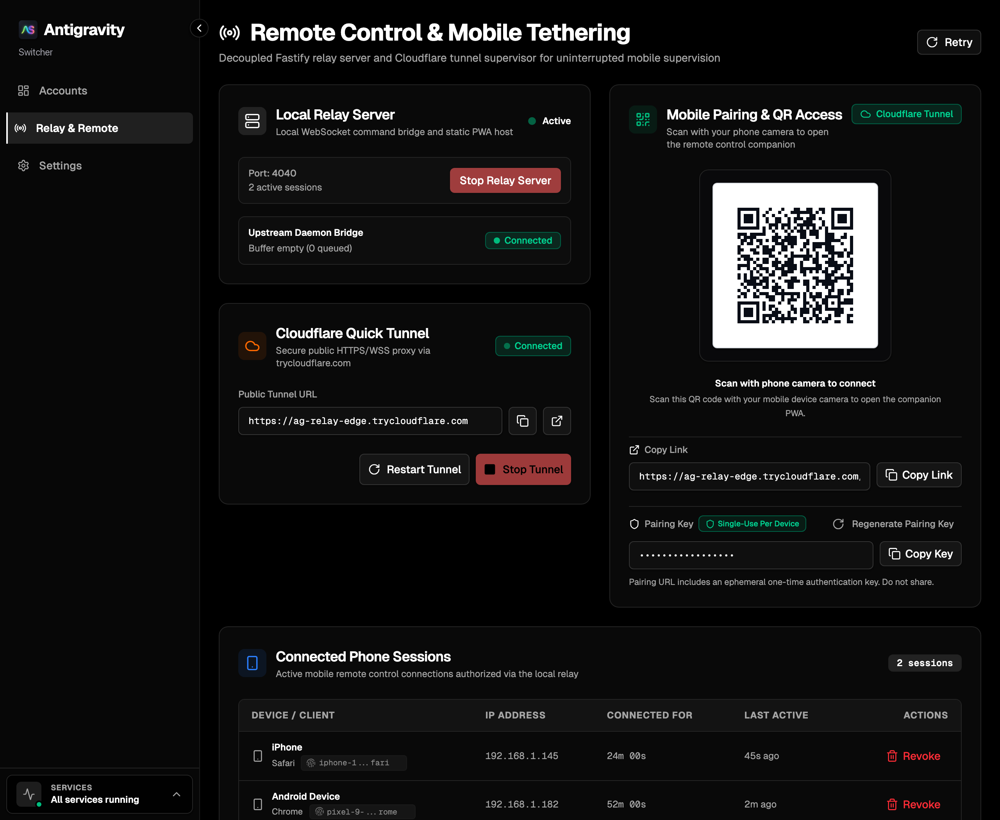
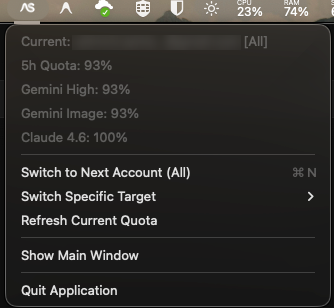
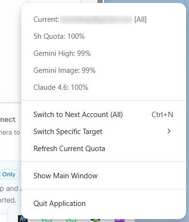

# Antigravity Switcher

Desktop account switcher, automated quota failover, and session continuity cockpit for Google Antigravity (**Antigravity App**, **Antigravity IDE**, and **Antigravity CLI**).



---

## Highlights

### 1. Multi-Target Account Switching & Quota Orchestration

The definitive **antigravity account switcher** for developers managing multiple Google accounts. Rotate accounts seamlessly when you hit 429 rate limits or quota ceilings across all Google Antigravity targets:

- **Antigravity App**: Standalone desktop AI cockpit.
- **Antigravity IDE**: AI-first code editor and agent cascade workspace.
- **Antigravity CLI**: Terminal command runner (`agy <command>`).

Track real-time quota fractions, rolling pool ceilings, and per-model limits (Gemini 2.5 Flash, Gemini 2.5 Pro, Claude 3.7 Sonnet) with instant one-click or automated quota failover.

### 2. Automated Quota Failover & Limit Tracking

Never lose developer flow when hitting daily quota exhaustion or 429 rate limit spikes.

- **Dynamic Account Rotation**: Automatically switch to next available pooled Google account upon quota exhaustion.
- **Unified & Independent Rotation**: Rotate all Antigravity runtime targets simultaneously or switch individual targets (e.g. CLI vs IDE) independently.
- **OAuth 2.0 Loopback Auth**: Add accounts quickly via local OAuth loopback with zero credential exposure.
- **Real-Time Depletion Tracking**: Monitor active reset countdown timers and pool balance at a glance.

### 3. Active Chat Auto-Resume Engine

Preserves in-flight prompts and continuous generations across account switches and process restarts.

- **Turn Capture & Checkpoints**: Captures active user turns and checkpoints SQLite database journals before runtime restart.
- **Ready Gate Dispatch**: Monitors language server readiness and re-dispatches prompts automatically once target processes stabilize.
- **Strict Model Fidelity**: Never silently downgrades your requested model. If quota is exhausted on the fallback account, safely preserves the prompt in a draft buffer.
- **Zero Prompt Loss**: Eliminates manual prompt copy-pasting during mid-cascade account rotations.

### 4. Context Window Telemetry & Compaction Monitoring

Inspect real-time token utilization, context window headroom, and compaction risk across active and concurrent cascade sessions.



- **Ground-Truth Budgets**: Dynamically decodes `ContextWindowMetadata` directly from Antigravity session protobufs (e.g. 160k for Claude Opus, 256k for Gemini Flash).
- **Multi-Card Session Stack**: Dedicated live telemetry cards for active and concurrent sessions with full token strips (Prompt Cached, Fresh Input, Thinking, Output).
- **Subagent Telemetry**: Real-time token breakdown and cost attribution for spawned subagents.
- **Compaction Alerting**: Visual risk badges (Normal, High Pressure, Critical Risk) warn before automated context eviction degrades agent reasoning.

### 5. Project-Grouped Broken Chat Cleaner & Pruner

Scans and prunes orphaned conversation summaries whose trajectory database files were evicted by Google Antigravity FIFO session limits (approx. 500 conversations), resolving persistent "Conversation unavailable" errors.



- **Multi-Target Pruning**: Independent inspection and pruning across Antigravity App, Antigravity IDE, and Antigravity CLI.
- **Project-Grouped Accordions**: Automatically groups orphaned conversation records by workspace folder with PII-masked paths.
- **Adaptive Disclosure**: Clean overview with auto-expansion for small workloads and collapsed trees for heavy multi-project setups.
- **Transactional Atomic Purge**: Atomic SQLite record deletion paired with immediate protobuf mirror cache invalidation (`agyhub_summaries_proto.pb`).
- **Concurrency Resilience**: Built-in defense against `SQLITE_BUSY` database lock collisions with automatic retries.

### 6. Mobile Remote Relay & Web UI Mirror

Supervise and rotate Antigravity Switcher sessions from mobile or secondary desktop browsers over local Wi-Fi or Cloudflare Tunnels.



- **Fastify Reverse Proxy**: Local remote relay server embedded within Antigravity Switcher.
- **Cloudflare Tunnel**: Optional one-click HTTPS/WSS pairing via `cloudflared`.
- **Tokenized QR Pairing**: Single-use cryptographic QR tokens for secure instant mobile pairing.
- **Device Management**: Persistent device tracking with one-click remote session revocation.

### 7. System Tray Quick Switcher

Resident in your macOS Menu Bar and Windows System Tray for instant account rotation.

|               macOS Menu Bar               |                   Windows System Tray                   |
| :----------------------------------------: | :-----------------------------------------------------: |
|  |  |

- **Instant Status Tooltip**: Shows active account email and target operational status.
- **Quick Switching**: Rotate accounts directly from the tray without opening the main window.
- **Background Mode**: Runs discreetly in the tray with zero idle CPU overhead.

---

## Search Intent & Developer Keywords

Antigravity Switcher is designed to solve the most pressing Google Antigravity pain points:

| Pain Point / Need       | Target Developer Queries                                                                                                                  | Solution Feature                                     |
| :---------------------- | :---------------------------------------------------------------------------------------------------------------------------------------- | :--------------------------------------------------- |
| **Account Switching**   | `antigravity account switcher`, `antigravity switch accounts`, `antigravity multi account`, `switch google account antigravity`           | Multi-Target Account Switching & Quota Orchestration |
| **Quota & Rate Limits** | `antigravity quota limit`, `antigravity quota failover`, `antigravity 429 rate limit`, `gemini quota switcher`                            | Automated Quota Failover & Limit Tracking            |
| **Session Continuity**  | `antigravity auto resume chat`, `antigravity recover prompt after switch`, `preserve in-flight prompts antigravity`                       | Active Chat Auto-Resume Engine                       |
| **Token Telemetry**     | `antigravity context window monitor`, `antigravity token telemetry`, `antigravity compaction risk`, `gemini flash context usage`          | Context Window Telemetry & Compaction Monitoring     |
| **Database Cleaning**   | `antigravity conversation unavailable`, `antigravity clean broken chats`, `antigravity sqlite orphan purge`, `prune broken conversations` | Project-Grouped Broken Chat Cleaner                  |
| **Remote Supervision**  | `antigravity mobile remote`, `antigravity phone web mirror`, `antigravity cloudflare tunnel`                                              | Mobile Remote Relay & Web UI Mirror                  |

---

## Supported Platforms & Artifacts

- **macOS**: Apple Silicon (`arm64`) and Intel (`x64`) - `.dmg` and `.zip`
- **Windows**: x64 and ARM64 - Installer (`.exe`) and Squirrel package (`.nupkg`)
- **Linux**: x64 (`amd64`) and ARM64 (`aarch64`) - Debian (`.deb`) and Red Hat (`.rpm`)

> **macOS Installation Note ("App is damaged")**:  
> For unsigned open-source builds, remove the quarantine attribute:
>
> ```bash
> xattr -cr "/Applications/Antigravity Switcher.app"
> ```

---

## Tech Stack

- **Runtime**: Electron 37+, Node.js 22+
- **Frontend**: React 19, Vite 6, Tailwind CSS 4, Radix UI, TanStack Router & Query
- **Backend / IPC**: Fastify, oRPC, SQLite (better-sqlite3) via Drizzle ORM
- **Packaging**: Electron Forge (Squirrel, DMG, ZIP, Deb, RPM)

---

## Quick Start

### Prerequisites

- Node.js >= 22.14.0
- pnpm >= 10
- `cloudflared` _(optional, for Cloudflare Tunnel remote pairing)_:
  - macOS: `brew install cloudflared`
  - Windows: `winget install --id Cloudflare.cloudflared`
  - Linux: `sudo apt install cloudflared`

### Installation

```bash
git clone https://github.com/hudiohizari/antigravity-relay.git
cd antigravity-relay
pnpm install
```

### Development

```bash
pnpm start
```

### Type Checking & Testing

```bash
pnpm run type-check
pnpm test
```

### Packaging & Distribution

```bash
pnpm run package
pnpm run make
```

---

## Storage, Security & Migration Continuity

- **Active Database**: `~/.antigravity-switcher/cloud_accounts.db` (AES-256-GCM authenticated encryption)
- **Active Config & Logs**: `~/.antigravity-switcher/`
- **Keyring Services**: `Antigravity Switcher Safe Storage` (macOS/Linux) and `AntigravitySwitcher` (Keytar)
- **Zero Data Loss Migration**: On first launch, Antigravity Switcher automatically and non-destructively migrates existing accounts, database records, and settings from `~/.antigravity-relay/` to `~/.antigravity-switcher/`. Existing credentials encrypted under legacy keys are decrypted seamlessly via keychain fallback chains with zero re-login required.

---

## License

MIT
